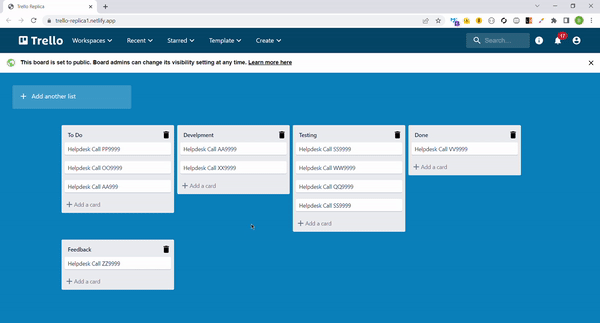

# Trello-Replica-Task

It is a web based list making application and is developed as a task for a frontend internship shortlisting project.

## Features

- Create new list
- Create new card
- Drag-n-drop cards between lists
- There are no API requests. I have managed the data in local storage.

## Demo

Application Link: - https://trello-replica1.netlify.app/

## Tech Stack

**Client:** React, Material UI, Local Storage

## Screenshots

- Add new card/ list

-Drag and drop

